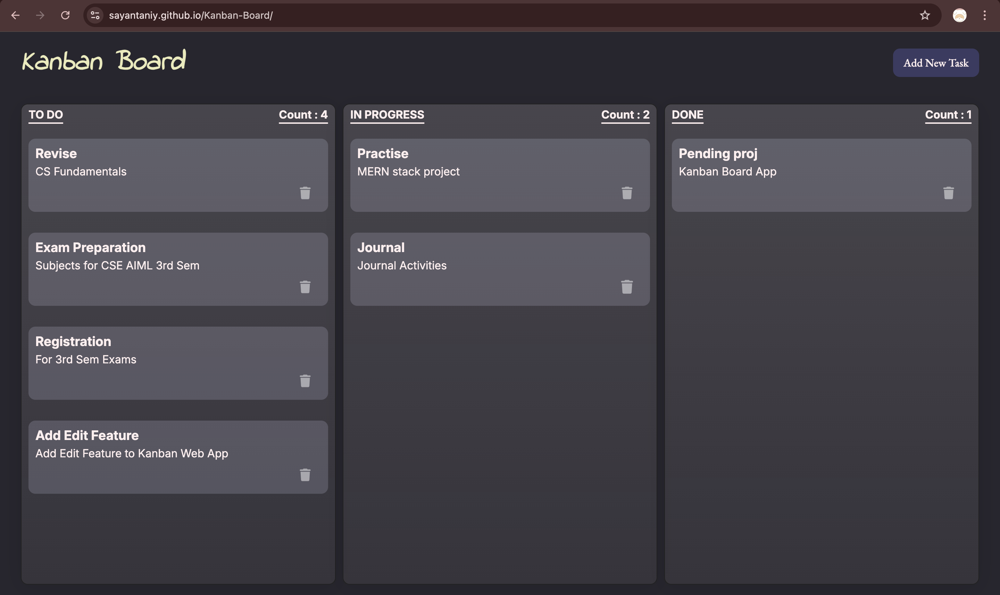

# 🗂️ Kanban Board (Vanilla JavaScript)

A **simple, clean, and fully functional Kanban Board** built using **pure HTML, CSS, and Vanilla JavaScript**.  
This project focuses on understanding **core frontend concepts** without relying on any frameworks or libraries.

---

## ✨ Features

✅ **Three Task Columns**
- 📝 **To Do**
- ⏳ **In Progress**
- ✅ **Done**

✅ **Create Tasks**
- Add a task with a **title** and **description**
- Tasks are dynamically rendered using JavaScript

✅ **Drag & Drop Support**
- Seamlessly move tasks between columns
- Uses native **HTML5 Drag and Drop API**

✅ **Persistent Storage**
- All tasks are saved in **LocalStorage**
- Tasks remain even after refreshing the page

✅ **Task Count Indicator**
- Each column shows the number of tasks it contains
- Updates automatically when tasks are moved

---

## 🧠 How It Works

### 🔹 Task Creation
- A task is created using JavaScript’s `document.createElement`
- Each task is marked as `draggable="true"`
- Task structure includes:
  - Title (`<h3>`)
  - Description (`<p>`)

---

### 🔹 Drag & Drop Logic
- `dragstart` → Stores the dragged task
- `dragover` → Allows dropping
- `drop` → Appends the task to the new column

This enables smooth movement between **To Do**, **In Progress**, and **Done** columns.

---

### 🔹 Local Storage Handling
- Tasks are stored as an object grouped by column IDs
- Example structure:
```js
{
  todo: [{ title, description }],
  progress: [{ title, description }],
  done: [{ title, description }]
}
```
---

## 🛠️ Tech Stack

| Technology | Purpose |
|-----------|---------|
|  **HTML5** | Structure and semantic markup |
|  **CSS3** | Styling, layout, and UI design |
|  **JavaScript** | Logic, DOM manipulation, and drag & drop |
|  **LocalStorage** | Persistent browser storage |

---
## 🧪 Testing / Preview

<br/>



<br/>


